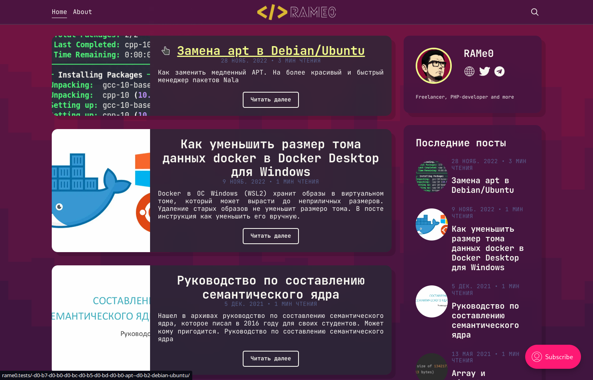

# RAMe0 dark Ghost theme

Mix of starter theme, dracula colors and my own ideas.

Theme includes sidebar and syntax highlighting.



## Sidebar

This theme includes sidebar with Author info, Last posts and Tags cloud.

Some stuff there is hardcoded, but you can change it in `partials/sidebar.hbs`.

### Additional social links in sidebar

Authors website, Facebook and Twitter links can be set in author profile setting .

To add custom links go to `Settings` -> `Code Injection` -> `Site Header` and add this code:

```html

<script>
    var SOCIAL_LINKS_COLLECTION = [
        {
            title: "Telegram",
            href: "https://t.me/<your_nik>",
            svg: "<svg fill=\"#000000\" xmlns=\"http://www.w3.org/2000/svg\"  viewBox=\"0 0 50 50\" width=\"100px\" height=\"100px\"><path d=\"M46.137,6.552c-0.75-0.636-1.928-0.727-3.146-0.238l-0.002,0C41.708,6.828,6.728,21.832,5.304,22.445\tc-0.259,0.09-2.521,0.934-2.288,2.814c0.208,1.695,2.026,2.397,2.248,2.478l8.893,3.045c0.59,1.964,2.765,9.21,3.246,10.758\tc0.3,0.965,0.789,2.233,1.646,2.494c0.752,0.29,1.5,0.025,1.984-0.355l5.437-5.043l8.777,6.845l0.209,0.125\tc0.596,0.264,1.167,0.396,1.712,0.396c0.421,0,0.825-0.079,1.211-0.237c1.315-0.54,1.841-1.793,1.896-1.935l6.556-34.077\tC47.231,7.933,46.675,7.007,46.137,6.552z M22,32l-3,8l-3-10l23-17L22,32z\"/></svg>",
        }, {
            title: "Github",
            href: "https://github.com/<your_nik>",
            icon: "https://github.githubassets.com/images/modules/logos_page/GitHub-Mark.png",
        }, {
            title: "Some other link",
            href: "href://some.other.link",
            icon: "some_other_link_icon.png",
        },
        {...},
        {...},
    ];
</script>
```

#### Social links options

- `href` - link url
- Icon image options:
    - Use `svg` to add svg icon code
    - Use `icon` to add link to icon image
- Optional:
    - `title` - link title
    - `class` - additional class for link

```html

## Theme structure

The main files are:

- [`default.hbs`](default.hbs) - The main template file
- [`index.hbs`](index.hbs) - Used for the home page
- [`post.hbs`](post.hbs) - Used for individual posts
- [`page.hbs`](page.hbs) - Used for individual pages
- [`tag.hbs`](tag.hbs) - Used for tag archives
- [`author.hbs`](author.hbs) - Used for author archives

One neat trick is that you can also create custom one-off templates just by adding the slug of a page to a template file. For example:

- `page-about.hbs` - Custom template for the `/about/` page
- `tag-news.hbs` - Custom template for `/tag/news/` archive
- `author-jamie.hbs` - Custom template for `/author/jamie/` archive

&nbsp;

## Development guide

The Starter theme provides a first-class development experience out of the box.

&nbsp;

### Setup

To see realtime changes during development, symlink the Starter theme folder to the `content/themes` folder in your local Ghost install.

```bash
ln -s /path/to/starter /ghost/content/themes/starter
```

Restart Ghost and select the Starter theme from **Settings**.

From the theme's root directory, install the dependencies:

```bash
npm install
```

If Node isn't installed, follow the [official Node installation guide](https://nodejs.org/).

&nbsp;

### Start development mode

From the Starter theme folder, start development mode:

```bash
npm run dev
```

Changes you make to your styles, scripts, and Handlebars files will show up automatically in the browser. CSS and
Javascript will be compiled and output to the `built` folder.

Press `ctrl + c` in the terminal to exit development mode.

&nbsp;

### Build, zip, and test your theme

Compile your CSS and JavaScript assets for production with the following command:

```bash
npm run build
```

Create a zip archive:

```bash
npm run zip
```

Use `gscan` to test your theme for compatibility with Ghost:

```bash
npm run test
```

&nbsp;

## Copyright & License

Copyright (c) 2023 RAMe0- Released under the [MIT license](LICENSE).

Copyright (c) 2013-2023 Ghost Foundation - Released under the [MIT license](LICENSE).
